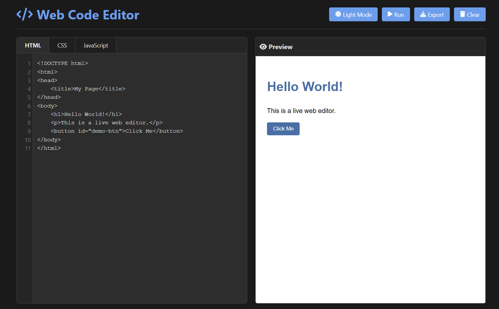

# 💻 Web Code Editor

A sleek, interactive, and responsive online **HTML, CSS, and JavaScript editor** with live preview and smart suggestions.



## 🚀 Live Demo

👉 [Visit the Web Code Editor](https://tikesh-sahu-git.github.io/web_code_editor/)

---

## ✨ Features

- 🧠 **Smart Suggestions** for HTML tags, CSS properties/values, and JavaScript methods
- 🧾 **Tabbed Interface** for HTML, CSS, and JavaScript editing
- 🌗 **Light/Dark Mode Toggle**
- ⚙️ **Live Preview** with auto-update (debounced)
- 💾 **Export Code** as a downloadable HTML file
- 🧹 **Clear Editor** with confirmation
- 📄 **Line Numbers** for all editors
- 🖱️ **Click and Keyboard Navigation** in suggestion dropdown

---

## 🛠️ Tech Stack

- HTML5
- CSS3 (with CSS Variables for theming)
- JavaScript (Vanilla)
- [Font Awesome](https://fontawesome.com/)
- [Highlight.js](https://highlightjs.org/) *(planned syntax highlighting)*

---

## 📁 Project Structure

web_code_editor/
│
├── index.html # Main HTML structure
├── style.css # All styles (light & dark themes)
├── script.js # Editor logic and features
└── screenshot.png 


---

## 🔧 Setup Instructions

```bash
# Clone the repo
git clone https://github.com/tikesh-sahu-git/web_code_editor.git

# Open in browser
cd web_code_editor
open index.html  # or manually open in browser

```

📬 Contact
Created with ❤️ by Tikesh Sahu
Feel free to contribute, suggest improvements, or report issues!
